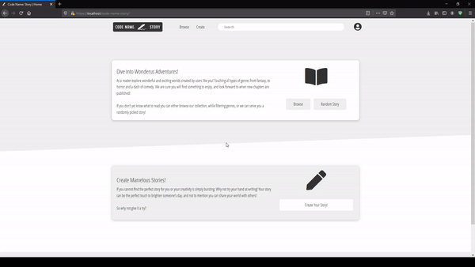
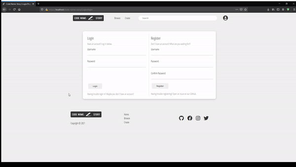
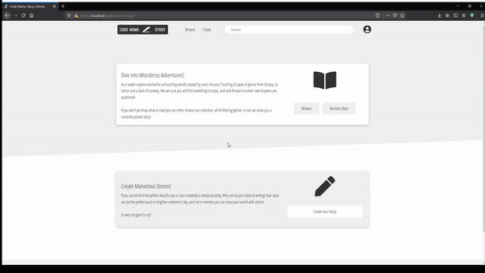
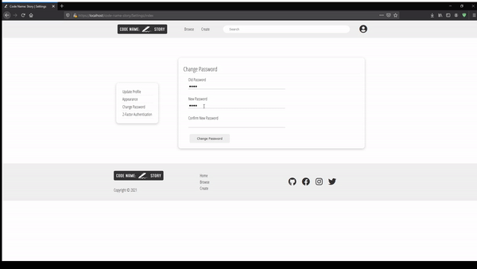
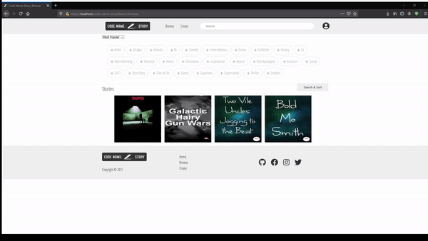
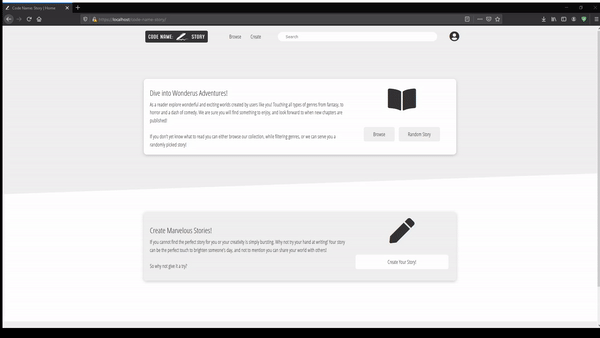
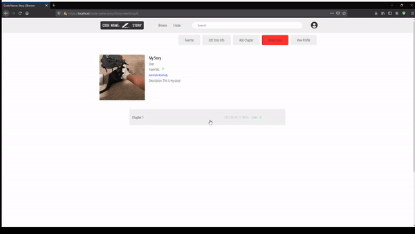

# Code Name: Story
A community platform centered around sharing stories.

## Installation Guide
---
This folder (`code-name-story`) should be directly in `htdocs`. The database shares the same name as the main folder `code-name-story`.

The way to get to the home page is as simple as typing `localhost/code-name-story` and you will be brought to the home page.

## User Stories
---
### **Story 001**
### **Card:** As a user, I can search up a story or a writer by direct string input.

### **Implementation:** 
```php
    //Inside the Story.php Object.
    public function findBySearch($search) {
        $search = '%'.$search.'%';
        $stmt = self::$connection->prepare("SELECT * FROM story WHERE title LIKE :search OR author LIKE :search");
        $stmt->execute(['search'=>$search]);
        $stmt->setFetchMode(\PDO::FETCH_GROUP|\PDO::FETCH_CLASS, "App\\models\\Story");
        return $stmt->fetchAll();
    }
```
### **Story 002**
### **Card:** As a user, I can filter stories by tags by checkbox selection.
```php
    //Inside Story.php Object.
    //Search By Individual Tag.
    public function findAllStoriesByTag($tag_id) {
        $stmt = self::$connection->prepare("SELECT * FROM story WHERE story_id IN (SELECT story_id FROM story_tags WHERE tag_id = :tag_id)");
        $stmt->execute(['tag_id'=>$tag_id]);
        $stmt->setFetchMode(\PDO::FETCH_GROUP|\PDO::FETCH_CLASS, "App\\models\\Story");
        return $stmt->fetchAll();
    }
    //Search By Multiple Tags, Included Order By.
    public function findAllStoriesByTagsOrdered($tag_ids, $order_by) {
        $placeholder = rtrim(str_repeat('?, ', count($tag_ids)), ', ');
        $query = "";
        switch($order_by) {
            case 'popular': $query = "SELECT * FROM story WHERE story_id IN (SELECT story_id FROM story_tags WHERE tag_id IN ($placeholder))"; break;
            case 'recent': $query = "SELECT * FROM story WHERE story_id IN (SELECT story_id FROM story_tags WHERE tag_id IN ($placeholder)) ORDER BY date_created DESC"; break;
            case 'asc': $query = "SELECT * FROM story WHERE story_id IN (SELECT story_id FROM story_tags WHERE tag_id IN ($placeholder)) ORDER BY title ASC"; break;
            case 'desc': $query = "SELECT * FROM story WHERE story_id IN (SELECT story_id FROM story_tags WHERE tag_id IN ($placeholder)) ORDER BY title DESC"; break;
            default: $query = "SELECT * FROM story WHERE story_id IN (SELECT story_id FROM story_tags WHERE tag_id IN ($placeholder))"; break;
        }    
        $stmt = self::$connection->prepare($query);        
        $stmt->execute($tag_ids);
        $stmt->setFetchMode(\PDO::FETCH_GROUP|\PDO::FETCH_CLASS, "App\\models\\Story");
        return $stmt->fetchAll();
    }
    //Implementation inside SearchController.php.
    //Search By Individual Tag.
    function browseBytag($tag_id){
        $story = new \App\models\Story();
        $story = $story->findAllStoriesByTag($tag_id);
        $this->view('Search/browse', ['stories'=>$story, 'tags'=>$tag_id]);
    }
    //Search By Multiple Tags And Order By.
    function browse() {
        if(isset($_POST['action'])) {
            $story = new \App\models\Story();
            if (isset($_POST['tags'])) {
                $stories = $story->findAllStoriesByTagsOrdered($_POST['tags'], $_POST['sorting']);
                $this->view('Search/browse', ['stories'=>$stories, 'tags'=>$_POST['tags']]);
            } else {
                $stories = $story->getAllOrdered($_POST['sorting']);
                $this->view('Search/browse', ['stories'=>$stories, 'tags'=>[]]);
            }
        } else {
            $story = new \App\models\Story();
            $stories = $story->getAll();
            $this->view('Search/browse', ['stories'=>$stories, 'tags'=>[]]);
        }
    }
```
### **Story 003**
### **Card:** As a user, I can sort stories by alphabetical order, and likes by dropdown menu selection.
```php
    public function getAllOrdered($order_by) {
        switch($order_by) {
            case 'popular': $stmt = self::$connection->prepare("SELECT * FROM story");break;
            case 'recent': $stmt = self::$connection->prepare("SELECT * FROM story ORDER BY date_created DESC"); break;
            case 'asc': $stmt = self::$connection->prepare("SELECT * FROM story ORDER BY title ASC"); break;
            case 'desc': $stmt = self::$connection->prepare("SELECT * FROM story ORDER BY title DESC"); break;
            default: $stmt = self::$connection->prepare("SELECT * FROM story"); break;
        }            
        $stmt->execute();
        $stmt->setFetchMode(\PDO::FETCH_GROUP|\PDO::FETCH_CLASS, "App\\models\\Story");
        return $stmt->fetchAll();
    }
```
### **Story 004**
### **Card:** As a user, I can sort a story by ascending or descending order by date.
```php
    //Implementation was made in the same section as the sort by alphabetical order, and likes by dropdown menu selection.
```
### **Story 005**
### **Card:** As a reader or a writer, I can register by submission of a registration form.
```php
    //Registration is a part of the login method, which checks for both login form submission and registration form submission.
    //Inside LoginController.php.
    $user = new \App\models\User();
    if ($user->findByUsername($_POST['username']) != null) {
        header('location:'.BASE.'/Login/login?error=Username Already Taken');
        exit(1);
    }
    $user->username = $_POST['username'];
    if($_POST['password'] == $_POST['confirm_password']) {
        $user->password_hash = password_hash($_POST['password'], PASSWORD_DEFAULT);
        $user->insert();
        $user = $user->findByUsername($user->username);
        $_SESSION['username'] = $user->username;
        $_SESSION['user_id'] = $user->user_id;
        header('location:'.BASE.'/home');
    } else
        header('location:'.BASE.'/Login/login?error=Passwords Dont Match');
    }else{
        $this->view('Login/login');
    }

    //Inside User.php Object.
    public function insert(){
        $stmt = self::$connection->prepare("INSERT INTO user(username, password_hash) VALUES (:username, :password_hash)");
        $stmt->execute(['username'=>$this->username, 'password_hash'=>$this->password_hash]);
    }
```
### **Story 006**
### **Card:** As a reader or writer, I can login by submission of login form.
```php
    //Login method in the LoginController.
    function login(){
        if(isset($_POST['login'])){
            $user = new \App\models\User();
            $user = $user->findByUsername($_POST['username']);    
            if($user != null && password_verify($_POST['password'], $user->password_hash)) {
                // Checks if user has 2fa enabled
                if ($user->token == null) {
                    $_SESSION['username'] = $_POST['username'];
                    $_SESSION['user_id'] = $user->user_id; 
                    $profile = new \App\models\Profile();
                    $profile = $profile->findByUserID($_SESSION['user_id']);
                    $_SESSION['profile_id'] = $profile->profile_id;
                    $_SESSION['account_type'] = $profile->account_type;
                    header('location:'.BASE.'/home');
                } else {
                    $_SESSION['tmp_username'] = $_POST['username'];
                    $_SESSION['tmp_user_id'] = $user->user_id;
                    $_SESSION['tmp_token'] = $user->token;
                    header('location:'.BASE.'/Login/validateLogin'); 
                }
            }else
                header('location:'.BASE.'/Login/login?error=Username/Password Mismatch');
        }

    //Inside User.php Object.
    public function findByUsername($username){
        $stmt = self::$connection->prepare("SELECT * FROM user WHERE username = :username");
        $stmt->execute(['username'=>$username]);
        $stmt->setFetchMode(\PDO::FETCH_GROUP|\PDO::FETCH_CLASS, "App\\models\\User");
        return $stmt->fetch();
    }
```
### **Story 007**
### **Card:** As a reader or writer, I can logout.
```php
    //Logout method in the LoginController.
    function logout(){
            session_destroy();
            header('location:'.BASE.'/Login/login');
        }        
```
### **Story 008**
### **Card:** As a reader or writer, I can create my profile by submission of profile creation form.
```php
    //The creation form being sent to the ProfileController.php.
    #[\App\core\LoginFilter]
        function createProfile() {
        if(isset($_SESSION['user_id'])){
            if(isset($_POST['action'])){
               $profile = new \App\models\Profile();
               $profile->user_id = $_SESSION['user_id'];
               $profile->account_type = $_POST['account_type'];
               $profile->description = $_POST['description'];
               $profile->insert();
               $profile = $profile->findByUserID($profile->user_id);
               $_SESSION['profile_id'] = $profile->profile_id;
               $_SESSION['account_type'] = $profile->account_type;
               header('location:'.BASE.'/home');
            } else {
                $this->view('Profile/createProfile');
            }
        }else{
            header('location:'.BASE.'/home');
        }
        }

    //The insert method is inside the Profile.php Object.
    public function insert(){
        $stmt = self::$connection->prepare("INSERT INTO profile(user_id, account_type, description) 
        VALUES (:user_id, :account_type, :description)");
        $stmt->execute(['user_id'=>$this->user_id, 'account_type'=>$this->account_type, 'description'=>$this->description]);
    }
```
### **Story 009**
### **Card:** As a reader or writer, I can modify my profile by submission of the profile edit form.
```php
    //The index of SettingsController is responsible for a lot of profile and user modifications, this snippet is responsible for modification of profile information.
    function index() {
            if(isset($_SESSION['profile_id'])){
            $profile = new \App\models\Profile();
            $profile = $profile->findByID($_SESSION['profile_id']);
            $user = new \App\models\User();
            $user = $user->findByUserID($_SESSION['user_id']);

            if (isset($_POST['profile'])) {
                $picture_controller = new \App\controllers\PictureController();
                if ($picture_controller->upload($_FILES['upload'], $_POST['alt'], "")) {
                    $picture = new \App\models\Picture();
                    if ($profile->profile_picture_id != null ) {
                        $profile->unsetProfilePicture();
                        $picture_controller->delete($profile->profile_picture_id);
                    }
                    $pictures = $picture->getAllByProfileID($profile->profile_id);
                    $profile->updateProfilePicture($pictures[0]->picture_id);   
                    $profile->description = $_POST['description'];
                    $profile->account_type = $_POST['account_type']; 
                    $profile->update();
                    header('location:'.BASE.'/Settings/index?success=Profile Updated');          
                } else if ($_FILES['upload']['tmp_name'] == "") {
                    $profile->description = $_POST['description'];
                    $profile->account_type = $_POST['account_type'];
                    $profile->update();
                    header('location:'.BASE.'/Settings/index?success=Profile Updated');
                } else {
                    header('location:'.BASE.'/Settings/index?error=Picture Invalid');
                }
            }
    //The Profile.php Object contains both the profile information update and the profile picture update.
    public function updateProfilePicture($picture_id){
        $stmt = self::$connection->prepare("UPDATE profile SET profile_picture_id = :profile_picture_id WHERE profile_id = :profile_id");
        $stmt->execute(['profile_id'=>$this->profile_id, 'profile_picture_id'=>$picture_id]);
    }

    public function update(){
        $stmt = self::$connection->prepare("UPDATE profile SET account_type = :account_type, description = :description WHERE profile_id = :profile_id");
        $stmt->execute(['profile_id'=>$this->profile_id, 'account_type'=>$this->account_type, 'description'=>$this->description]);
    }
```
### **Story 010**
### **Card:** As a reader, I can upgrade my private to become a writer. And go back as being a reader when switching back.
```php
    //The account type is being updated by the same SettingsController.
    //The update is being updated by the same Profile.php update method.
    public function update(){
        $stmt = self::$connection->prepare("UPDATE profile SET account_type = :account_type, description = :description WHERE profile_id = :profile_id");
        $stmt->execute(['profile_id'=>$this->profile_id, 'account_type'=>$this->account_type, 'description'=>$this->description]);
    }
```
### **Story 011**
### **Card:** As a reader, I can comment on other user’s stories by submission of the comment form.
```php
    if(isset($_POST["comment"])){
        $text = $_POST['text'];

        if($text == null){
            
        } else {
            $comment = new \App\models\Comment();
            $comment->chapter_id = $chapter_id;
            $comment->profile_id = $_SESSION['profile_id'];
            $comment->text = $text;
            $comment->insert();
        }
    }
```
### **Story 012**
### **Card:** As a reader, I can edit my comments using an edit form.
```php
    public function editComment($comment_id){            
        $comment = new \App\models\Comment();
        $comment = $comment->findCommentByID($comment_id);
        if(isset($_POST['update'])){
            $comment->text = $_POST['text'];
            $comment->update();
            header('location:'.BASE.'/Comment/viewComment/'.$comment_id);
        } else {
            $this->view('Comment/editComment', $comment);
        }
    }
```
### **Story 013**
### **Card:** As a reader, I can delete my comments using a delete button.
```php
    //The delete is being called to the CommentController.php.
    public function deleteComment($comment_id){            
        $comment = new \App\models\Comment();
        $comment = $comment->findCommentByID($comment_id);
        $comment->delete();
        header('location:'.BASE.'/Chapter/viewChapter/'.$comment->chapter_id);
    }
    //The deletion of the comment from the database happens in the Comment.php Object.
```
### **Story 014**
### **Card:** As a reader, I can reply to a comment using the reply form.
```php
    //The delete is being called to the CommentController.php.
    public function deleteComment($comment_id){            
        $comment = new \App\models\Comment();
        $comment = $comment->findCommentByID($comment_id);
        $comment->delete();
        header('location:'.BASE.'/Chapter/viewChapter/'.$comment->chapter_id);
    }
    //The reply gets added to the database through the comment object, in both the comment table and the reply table.
    public function insertReply($original_comment_id){
        $this->insert();
        $comment = new \App\models\Comment();
        $comment = $this->getCommentsIDForProfile($this->profile_id);
        $reply = new \App\models\Reply();
        $reply->original_comment_id = $original_comment_id;
        $reply->reply_id = $comment[0]->comment_id;
        $reply->insert();
    }

    //Inside Reply.php.
    public function insert(){
        $stmt = self::$connection->prepare("INSERT INTO reply(reply_id, original_comment_id) VALUES (:reply_id, :original_comment_id)");
        $stmt->execute(["reply_id"=>$this->reply_id, "original_comment_id"=>$this->original_comment_id]);
    }
```
### **Story 015**
### **Card:** As a reader, I can like other user’s chapters using a like button.
```php
    //The method is being called from the CommentController.
    if(isset($_POST["reply"])){
        $text = $_POST['text'];

        if($text == null){
            
        } else {
            $comment = new \App\models\Comment();
            $comment->chapter_id = $original_comment->chapter_id;
            $comment->profile_id = $_SESSION['profile_id'];
            $comment->text = $text;
            $comment->insertReply($comment_id);
        }
    }
```
### **Story 016**
### **Card:** As a reader, I can favorite other writer’s stories via a “favourite” button.
```php
    //The favorite story system works the same way as like chapter, it is being called in StoryController.
    function subscribe($story_id){
        $favorite_story = new \App\models\FavoriteStory();
        $favorite_story->profile_id = $_SESSION['profile_id'];
        $favorite_story->story_id = $story_id;
        $favorite_story->insert();
        header('location:'.BASE.'/Story/viewStory/'.$story_id);
    }

    function unsubscribe($story_id){
        $favorite_story = new \App\models\FavoriteStory();
        $favorite_story->profile_id = $_SESSION['profile_id'];
        $favorite_story->story_id = $story_id;
        $favorite_story->delete();
        header('location:'.BASE.'/Story/viewStory/'.$story_id);
    }
```
### **Story 017**
### **Card:** As a reader, I can change the look of the website, such as colours (e.g. Dark mode).
```php
    //The theme of the current user is updated.
    if (isset($_POST['theme'])) {
        $profile->theme = $_POST['color_scheme'];
        $profile->updateTheme();
        header('location:'.BASE.'/Settings/index');
    //The update happens in the Profile.php Object.
    public function updateTheme(){
        $stmt = self::$connection->prepare("UPDATE profile SET theme = :theme WHERE profile_id = :profile_id");
        $stmt->execute(['theme'=>$this->theme, 'profile_id'=>$this->profile_id]);
    }
    //The team gets generated using the appropriate CSS file following this logic.
    //Gets the theme for the current user and spawns the appropriate dependencies.
    function spawnDependencies() {
        echo "<link rel='icon' type='image/x-ico' href='favicon.ico'/>";
        if (isset($_SESSION['profile_id'])) {
            $profile = new \App\models\Profile();
            $profile = $profile->findByID($_SESSION['profile_id']);
            switch ($profile->theme) {
                case "light":
                    echo "<link rel='stylesheet' href='css/style.css' type='text/css'>";
                    echo "<link rel='stylesheet' href='css/utilities.css' type='text/css'>";
                  break;
                case "dark":
                    echo "<link rel='stylesheet' href='css/style-dark.css' type='text/css'>";
                    echo "<link rel='stylesheet' href='css/utilities-dark.css' type='text/css'>";
                  break;
                case "green":
                    echo "<link rel='stylesheet' href='css/style-green.css' type='text/css'>";
                    echo "<link rel='stylesheet' href='css/utilities-green.css' type='text/css'>";
                  break;

                case "blue":
                    echo "<link rel='stylesheet' href='css/style-blue.css' type='text/css'>";
                    echo "<link rel='stylesheet' href='css/utilities-blue.css' type='text/css'>";
                  break;
            }   
        } else {
            echo "<link rel='stylesheet' href='css/style.css' type='text/css'>";
            echo "<link rel='stylesheet' href='css/utilities.css' type='text/css'>";
        }
        echo "<link rel='stylesheet' href='https://cdnjs.cloudflare.com/ajax/libs/font-awesome/5.15.3/css/all.min.css'>";
        echo "<script src='https://ajax.googleapis.com/ajax/libs/jquery/3.6.0/jquery.min.js'></script>";
        echo "<script src='js/navbar.js'></script>";
    }
```
### **Story 018**
### **Card:** As a writer, I can post my own stories on the website by filling the creation form.
```php
    //The story creation is being called to the StoryController.php.
    #[\App\core\LoginFilter]        
    #[\App\core\ProfileFilter] 
    function createStory(){
    if(isset($_SESSION['profile_id'])){
        if($_SESSION['account_type'] == "writer"){
        if(isset($_POST['action'])){
            $story = new \App\models\Story();                
            $picture_controller = new \App\controllers\PictureController();
            if ($picture_controller->upload($_FILES['upload'], $_POST['title']." cover", $_SESSION['username'])) {
                $picture = new \App\models\Picture();
                $pictures = $picture->getAllByProfileID($_SESSION['profile_id']);
                $story->profile_id = $_SESSION['profile_id'];
                $story->title = $_POST['title'];
                $story->description = $_POST['description'];
                $story->author = $_POST['author'];
                $story->insert();
                $stories = $story->findByProfile($_SESSION['profile_id']);
                $story = $stories[count($stories) - 1];
                if (isset($_POST['tag'])) {                   
                    $story->addTagsToStory($story->story_id, $_POST['tag']);
                }
                $story->story_picture_id = $pictures[0]->picture_id;
                $story->updateCoverPicture();                    
            } else {
                header('location:'.BASE.'/Story/createStory?error=Invalid Picture, allowed extensions are: .png, .jpg/.jpeg and .gif.');
            }
            $this->view('Story/storyList', $stories);
            } else {
            $this->view('Story/createStory');
            }
        }else{
            header("location:".BASE."/Settings/index");
        }
        }else{
            header("location:".BASE."/Login");
        }
    }
    //The story is being inserted through the Story.php.
    public function insert() {
        $stmt = self::$connection->prepare("INSERT INTO story(profile_id, title, description, author) VALUES (:profile_id, :title, :description, :author)");
        $stmt->execute(["profile_id"=>$this->profile_id, "title"=>$this->title, "description"=>$this->description, "author"=>$this->author]);
    }
```
### **Story 019**
### **Card:** As a writer, I can modify my own stories on the website by clicking the ‘Edit’ button.
```php
    //The Edit method is being called from the StoryController.php.
    #[\App\core\LoginFilter]        
    #[\App\core\ProfileFilter] 
    function editStory($story_id) {
    if(isset($_SESSION['profile_id'])){
        if($_SESSION['account_type'] == "writer"){
        if(isset($_POST['action'])) {
            $story = new \App\models\Story();
            $story = $story->findByID($story_id);
            $story->title = $_POST['title'];
            $story->author = $_POST['author'];
            $story->description = $_POST['description'];
            $story->update();
            if (isset($_POST['tag'])) {
                $story->addTagsToStory($story_id, $_POST['tag']);
            }
            if ($_FILES['upload']['tmp_name'] != "") {
                if ($picture_controller->upload($_FILES['upload'], $_POST['title']." cover", $_POST['author'])) {
                    $picture = new \App\models\Picture();
                    if ($story->story_picture_id != null ) {
                        $picture_id = $story->story_picture_id;
                        $story->unsetCoverPicture();
                        $picture_controller->delete($picture_id);
                    }
                    $pictures = $picture->getAllByProfileID($_SESSION['profile_id']);
                    $story->story_picture_id = $pictures[0]->picture_id;
                    $story->updateCoverPicture();          
                } else {
                    header('location:'.BASE.'/Story/editStory/'.$story_id.'?error=Picture Invalid');
                }
            }
            header('location:'.BASE.'/Story/viewStory/'.$story_id.'?success=Story Editied');
        } else {
            $story = new \App\models\Story();
            $story = $story->findByID($story_id);
            $picture = new \App\models\Picture();
            $picture = $picture->findByPictureID($story->story_picture_id);
            $this->view('Story/editStory', ['story'=>$story, 'picture'=>$picture]);                
        }
    }else{
        header("location:".BASE."/Settings/index");
    }
    }else{
        header("location:".BASE."/Login");
    }
    }
    //The story update happens inside the Story.php Object.
    public function update() {
        $stmt = self::$connection->prepare("UPDATE story SET title = :title, author = :author, description = :description WHERE story_id = :story_id");
        $stmt->execute(['title'=>$this->title, 'author'=>$this->author, 'description'=>$this->description, 'story_id'=>$this->story_id]);
        $stmt->setFetchMode(\PDO::FETCH_GROUP|\PDO::FETCH_CLASS, "App\\models\\Story");
        return $stmt->fetchAll();
    }

    public function updateCoverPicture() {
        $stmt = self::$connection->prepare("UPDATE story SET story_picture_id = :story_picture_id WHERE story_id = :story_id");
        $stmt->execute(['story_picture_id'=>$this->story_picture_id, 'story_id'=>$this->story_id]);
        $stmt->setFetchMode(\PDO::FETCH_GROUP|\PDO::FETCH_CLASS, "App\\models\\Story");
        return $stmt->fetchAll();
    }
```
### **Story 020**
### **Card:** As a writer, I can delete my own stories on the website by navigating to the story in question and clicking the ‘Delete’ button.
```php
    //The delete is being called in the StoryController.
    #[\App\core\LoginFilter]        
    #[\App\core\ProfileFilter] 
    function deleteStory($story_id) {
        $story = new \App\models\Story();
        $story = $story->findByID($story_id);
        if ($_SESSION['profile_id'] == $story->profile_id)
            $story->delete();
        header('location:'.BASE.'/Story/storyList');
    }
    //The removal of the data happens in the Story.php Object.
    public function delete() {
        $tag = new \App\models\StoryTag();
        $tag->deleteAllTagsForStory($this->story_id);
        if ($this->story_picture_id != null) {
            $this->unsetCoverPicture();
            $picture = new \App\models\Picture();
            $picture->findByPictureID($this->story_picture_id);
            $picture->delete();
        }
        $stmt = self::$connection->prepare("DELETE FROM story WHERE story_id = :story_id");
        $stmt->execute(['story_id'=>$this->story_id]);
    }
```
### **Story 021**
### **Card:** As a Writer, I can add chapters to my own stories using the Chapter creation form.
```php
    //The adding chapter method gets called in ChapterController.php.
    //The story gets saved in a .txt file, and only the path to that file gets sen to the database.
    function createChapter($story_id){
        if(isset($_SESSION['profile_id']) && $_SESSION['account_type'] == "writer"){
            if(isset($_POST['action'])) {
                $chapter = new \App\models\Chapter();
                $chapter->story_id = $story_id;
                $chapter->chapter_title = $_POST['chapter_title'];
                $targetFolder = 'stories/';
                $targetFile = uniqid().'.txt';
                file_put_contents($targetFolder.$targetFile, $_POST['chapter_text']);
                $chapter->chapter_text = $targetFile;
                $chapter->insert();
                header('location:'.BASE.'/Story/viewStory/'.$story_id);
            } else {
                $chapter = new \App\models\Chapter();
                $chapters = $chapter->findByStoryID($story_id);
                $this->view('Chapter/createChapter', count($chapters));
            }
        }else{
            header("location:".BASE."/home");
        }
    }
    //The insertion of the chapter happens in the Chapter.php Object.
    public function insert(){
        $stmt = self::$connection->prepare("INSERT INTO chapter(story_id, chapter_title, chapter_text) VALUES (:story_id, :chapter_title, :chapter_text)");
        $stmt->execute(["story_id"=>$this->story_id, "chapter_title"=>$this->chapter_title,"chapter_text"=>$this->chapter_text]);
    }
```
### **Story 022**
### **Card:** As a writer, I can modify my own chapters on the website by clicking the ‘Edit’ button.
```php
    //The edit method gets called in the ChapterController.php.
    function editChapter($chapter_id) {
    if(isset($_SESSION['profile_id']) && $_SESSION['account_type'] == "writer"){
        if(isset($_POST['action'])) {
            $chapter = new \App\models\Chapter();
            $chapter = $chapter->findByID($chapter_id);
            $chapter->chapter_title = $_POST['chapter_title'];
            $targetFolder = 'stories/';
            $targetFile = $chapter->chapter_text;
            file_put_contents($targetFolder.$targetFile, $_POST['chapter_text']);
            $chapter->update();
            header('location:'.BASE.'/Story/viewStory/'.$chapter->story_id);
        } else {
            $chapter = new \App\models\Chapter();
            $chapter = $chapter->findByID($chapter_id);
            $this->view('Chapter/editChapter', $chapter);
        }
    }else{
            header("location:".BASE."/home");
        }
    }
    //The story gets updated in the Chapter.php Object.
    public function update() {
        $stmt = self::$connection->prepare("UPDATE chapter SET chapter_title = :chapter_title WHERE chapter_id = :chapter_id");
        $stmt->execute(["chapter_id"=>$this->chapter_id, "chapter_title"=>$this->chapter_title]);
    }
```
### **Story 023**
### **Card:** As a writer, I can delete my own chapters on the website by navigating to the story in question and clicking the ‘Delete’ button.
```php
    //The delete method gets called in the ChapterController.php.
    function deleteChapter($chapter_id) {
    if(isset($_SESSION['profile_id']) && $_SESSION['account_type'] == "writer"){
        $chapter = new \App\models\Chapter();
        $chapter = $chapter->findByID($chapter_id);                
        $path = getcwd().DIRECTORY_SEPARATOR.'stories'.DIRECTORY_SEPARATOR.$chapter->chapter_text;
        unlink($path);
        $chapter->delete();
        header('location:'.BASE.'/Story/viewStory/'.$chapter->story_id);
        }
    else{
            header("location:".BASE."/home");
    }
    }
    //The deletion of the data from the database happens in the Chapter.php Object.
    public function delete() {
        $stmt = self::$connection->prepare("DELETE FROM chapter WHERE chapter_id = :chapter_id");
        $stmt->execute(['chapter_id'=>$this->chapter_id]);
    }
```

## User Guide (Examples of functionality)
---

### **Browse by Tag, Sort and Search**


### **User Registration and Profile Creation**


### **User Login and Logout**


### **Settings**



### **Comment and Reply; Create, Edit and Delete**


### **Like and Favorite**


### **Story and Chapter; Create, Edit and Delete**

